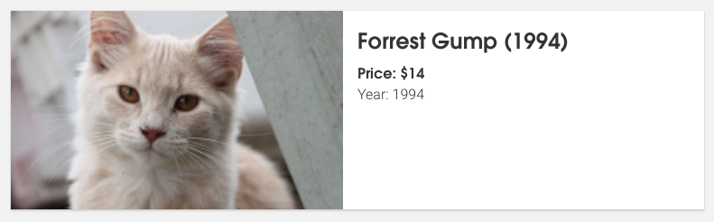
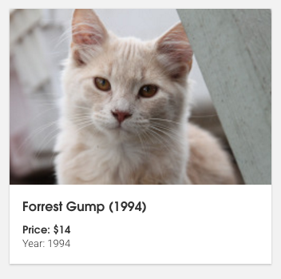

### Setup

* Install Node 6.1
* Clone repo, cd into directory
* `npm install`

### Run

`npm run start`

### Questions
- If anything is unclear or seems off as you work on the task don't hesistate to ask us.

## Instructions

To submit your solution, create a Pull Request (PR) on your forked project. Please write a comment in your Pull Request about your code, as though explaining your solution to a less-experienced developer.

The PR should complete this user story:

```
User should be able to see a list of 200 movies, 
both 4-star and 5-star, sorted by year and then by title. 
The application should match the mock and 
work on the latest versions of chrome and firefox
```

##### Acceptance criteria:

- User clicks the “get movies” button
- User see a list of movies sorted primarily by year, secondarily by title. All in one list
- User sees list items optimized for their viewport size based on the mocks
- All columns in the display are populated

##### We will evaluate you on how well you can:

- Complete the acceptance criteria.
- Write clear, high-quality code.
- Communicate clearly (ex: in your Pull Request comment)

## Styling

- We are particulary interested in how you style and structure the application. 

- Think about designing your react components and styles in a extensible way. 
- The design does not need to be pixel perfect, but it should look and act how the mock does. 
- SASS and CSS loaders are included in the webpack configuration, so any `.css` or `.scss` files can be imported into `client-entry.js` and they will be applied. Feel free to use an inline css library, like Aphrodite or glamor, if you prefer to style your components in JS.

## Mocks

#### Obligatory cat gif


#### Desktop style for >= 600px


#### Tablet/Phone style for < 600px


